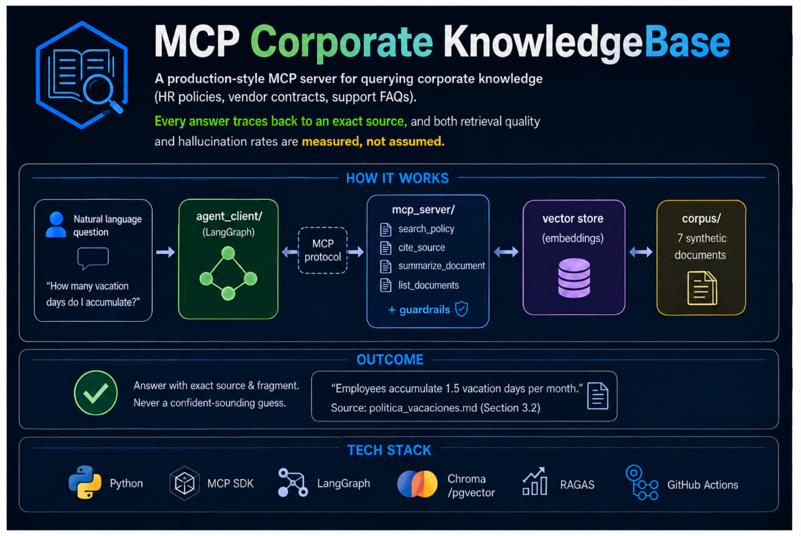

# mcp-corporate-kb

---
<p align="center">
  
</p>

> **Status: work in progress.** Phase 1 (corpus + golden set) is done. The rest of the pipeline is being built phase by phase (see [Roadmap](#roadmap)). Commands in the Quickstart become runnable as each phase lands.

## Why this project exists

Across current job postings for Agentic AI / LLM engineering roles, one requirement shows up again and again: **"having built or operated an MCP server, not just consumed one"** — and, right next to it, **"evaluation as a first-class deliverable"** (golden datasets, faithfulness scoring, hallucination detection, quality gates in CI).

This project is a direct, hands-on answer to both. It's not a LangChain tutorial with a new coat of paint — it's an MCP server built around a real enterprise pain point (scattered policies and contracts nobody wants to re-read), with a measurement pipeline that proves the system is trustworthy enough for that use case.

## What it does

An employee (or an agent acting on their behalf) asks a natural-language question — *"how many vacation days do I accumulate?"*, *"what's the termination notice period with CloudTech?"* — and gets back an answer **grounded in an exact document and fragment**, never a confident-sounding guess.

## Repo structure

The repository is `mcp-corporate-kb`; the Python package is named `groundedkb`.

```
mcp-corporate-kb/
├── README.md
├── pyproject.toml                 # package: groundedkb
├── .github/workflows/ci.yml       # lint + tests + eval as a CI gate (planned)
│
├── corpus/                        # 8 synthetic corporate documents
│   ├── vacation_policy.md
│   ├── remote_work_policy.md
│   ├── onboarding_manual.md
│   ├── vendor_contract_cloudtech.md
│   ├── vendor_contract_it_support.md
│   ├── it_support_faq.md
│   ├── expense_policy.md
│   └── code_of_conduct.md
│
├── ingestion/                      # chunking, embeddings, vector store build
│   ├── chunking.py
│   ├── embeddings.py
│   ├── vectorstore.py
│   └── build_index.py
│
├── mcp_server/                     # the MCP server — knows nothing about "agents"
│   ├── server.py
│   ├── tools/
│   │   ├── search_policy.py
│   │   ├── summarize_document.py
│   │   ├── cite_source.py
│   │   └── list_documents.py
│   └── guardrails.py               # scoping, structured logging
│
├── agent_client/                   # thin consumer of the MCP server
│   ├── agent.py
│   └── prompts.py
│
├── eval/                           # the differentiator
│   ├── golden_set.json             # 16 questions (14 factual + 2 trick)
│   ├── run_eval.py                 # runs v0 vs v1 against the golden set
│   ├── metrics.py                  # faithfulness, hallucination rate, etc.
│   └── results/                    # versioned output of each run
│
├── experiments/                    # self-contained side studies
│   └── rag-vs-llamaindex/          # custom RAG vs LlamaIndex (in progress)
│
└── tests/
    ├── test_mcp_tools.py
    └── test_ingestion.py
```

## Key features

- **MCP server, not a wrapper** — `mcp_server/` implements the official MCP SDK directly, with 4 real tools (search, summarize, cite-source, list-by-category), permission scoping per document category, and structured audit logging on every tool call.
- **Citation is not optional** — every answer must resolve to a specific document + fragment. If it can't, the system says so instead of guessing.
- **Two measured versions, not one** — `v0` (naive similarity search) vs `v1` (hybrid retrieval + reranking + forced citation), so the improvement is a number, not a claim.
- **Hallucination is explicitly tested for** — the golden set includes trick questions with no real answer in the corpus, specifically to catch a system that fabricates one.
- **Evaluation wired into CI** — `eval/run_eval.py` runs as part of the pipeline, so a regression in faithfulness or hallucination rate is caught before merge, not after a customer complaint.

## Quickstart

```bash
git clone https://github.com/marcolo-30/mcp-corporate-kb.git
cd mcp-corporate-kb
pip install -e .

# 1. Build the vector index from the corpus
python -m ingestion.build_index

# 2. Run the MCP server
python -m mcp_server.server

# 3. In another terminal, run the agent client
python -m agent_client.agent
```

Full setup should take under 5 minutes on a clean environment once all phases are complete.

## Evaluation methodology

The same 16-question golden set (`eval/golden_set.json`) is run against two system configurations. Results below are populated by `eval/run_eval.py` — not hand-written.

| Metric | v0 (naive RAG) | v1 (MCP + hybrid + reranking) | Delta |
|---|---|---|---|
| Answer Correctness | *pending first run* | *pending first run* | — |
| Faithfulness / Groundedness | *pending first run* | *pending first run* | — |
| Citation Precision | *pending first run* | *pending first run* | — |
| Retrieval Precision@3 | *pending first run* | *pending first run* | — |
| Hallucination Rate | *pending first run* | *pending first run* | — |
| Latency (p95) | *pending first run* | *pending first run* | — |

Metrics computed with [RAGAS](https://github.com/explodinggradients/ragas) where applicable (faithfulness, context precision), plus custom scoring for citation accuracy and the trick-question hallucination check.

## Experiments

### `experiments/rag-vs-llamaindex/` — RAG from scratch vs LlamaIndex

A controlled comparison of the same retrieval pipeline built twice behind one Python interface: **(A)** a custom implementation (chunking, embeddings, vector store, retrieval written by hand) and **(B)** LlamaIndex (vector, hybrid BM25+vector, and hybrid + reranking). It reuses this repo's `corpus/` and an extended copy of the golden set, and reports deterministic retrieval metrics (recall@k, MRR, precision@3), RAGAS and latency.

Status: **in progress** — hypotheses, method and results live in that folder's README. No results have been produced yet.

## Roadmap

- [x] Phase 1 — Synthetic corpus (8 docs) + golden set (16 Q&A pairs, incl. 2 trick questions)
- [ ] Phase 2 — Ingestion pipeline (chunking, embeddings, vector store)
- [ ] Phase 3 — MCP server with 4 tools + guardrails
- [ ] Phase 4 — Agent client (LangGraph) consuming the MCP server
- [ ] Phase 5 — Evaluation pipeline (v0 vs v1, CI-gated)
- [ ] Phase 6 — Packaging: architecture diagram, demo recording, CI green
- [ ] Side study — RAG from scratch vs LlamaIndex (`experiments/rag-vs-llamaindex/`)

## Tech stack

Python · MCP SDK · LangGraph · Chroma/pgvector · RAGAS · GitHub Actions · LlamaIndex (experiments only)

## Why this exists (short version, for the skim-readers)

Built to close a specific, named gap in current Agentic AI job postings: real MCP server experience, paired with evaluation rigor instead of vibes-based "it seems to work."